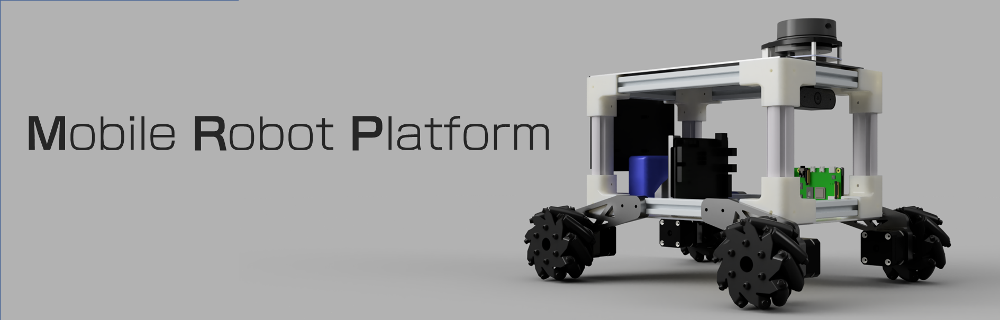

## Table of contents

- [What's the project about?](#whats-this-project-about)
- [What's the project goal?](#project-goal)
- [Repository layout](#repository-layout)
- [Quick start guide](#quick-start-guide)
- [Quick update check](#update-journal)
- [Check some visuals](#visuals)

## Update Journal

| Date | Description | Visual |
| :-: | :-: | :-: |

## Visuals

### :point_right: Virtual

| 360° | Angle  |
| :-: | :-: |
 | 

### :point_right: Real

| Angle | Inside Close-up |
| :-: | :-: |
 | 